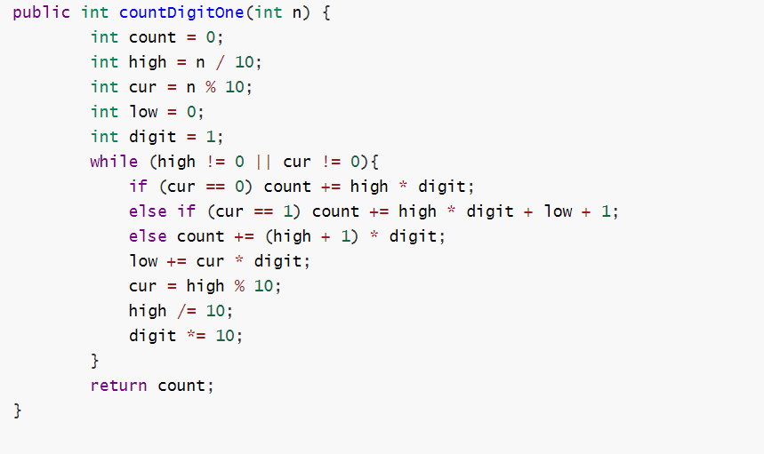

# 计算机

## 	人工智能

### 		大数据

##### 			下面我们对这段代码进行分析，如下图所示

```java
public static void main(String[] args) {
        int countDigitOne = new _43_CountDigitOne().countDigitOne(12);
        System.out.println(countDigitOne);
}

public int countDigitOne(int n) {
        int count = 0;
        int high = n / 10;
        int cur = n % 10;
        int low = 0;
        int digit = 1;
        while (high != 0 || cur != 0){
            if (cur == 0) count += high * digit;
            else if (cur == 1) count += high * digit + low + 1;
            else count += (high + 1) * digit;
            low += cur * digit;
            cur = high % 10;
            high /= 10;
            digit *= 10;
        }
        return count;
}
```




